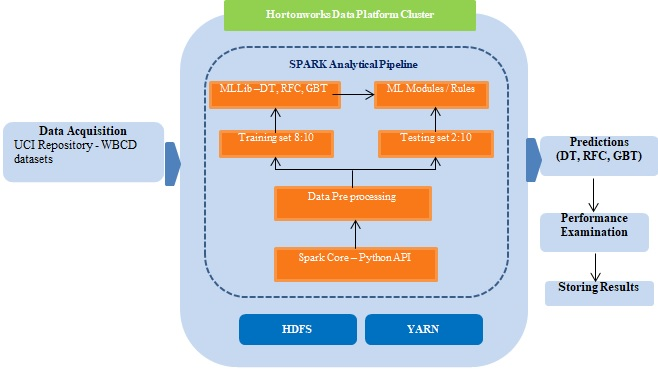
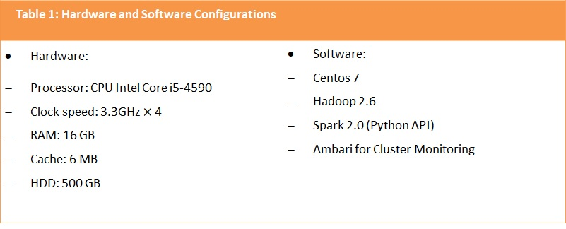
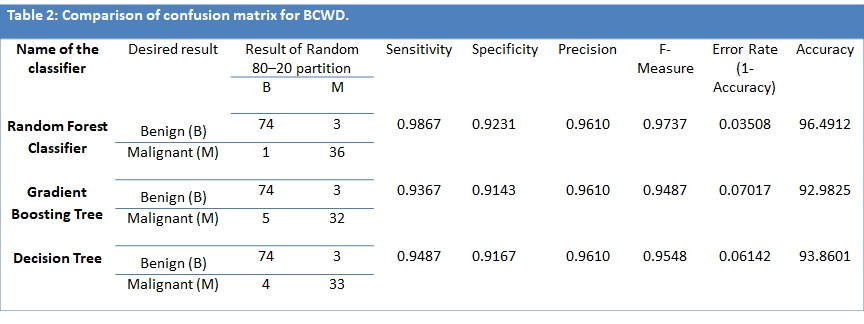
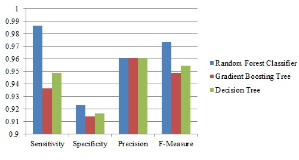

# Spark based Framework for Breast Cancer Analysis 

This is an implementation of [Spark based BC](https://papers.ssrn.com/sol3/papers.cfm?abstract_id=3125283) on Python, Bigdata-Spark, and MLLib. The experiments are conducted using [Wisconsin Breast Cancer Dataset](https://archive.ics.uci.edu/ml/datasets/breast+cancer+wisconsin+(original)) from UCI repository. 

# Introduction
 
* Breast cancer is the second foremost reason for death among women in the world. In India, around 150,000 females were newly noticed and nearby 70,000 cases died amongst them. Large amounts of data about the patients with their medical conditions are presented in the medical databases. Breast cancer is one of the most important medical problems. The growth of the amount of data and the number of existing databases far exceeds the ability of humans to analyze this data.  Analyzing all these databases is one of the difficult tasks in the medical environment. 

* To satisfy the computational necessities of enormous medical data examination, a well-organized structure is fundamental to the configuration, execute and deal with the required pipelines and algorithms. In such manner, Apache Spark has emerged as a fused technique for large-scale data analysis. It has presented a novel method for data science and engineering. Apache Spark has turned into the most dynamic big data open source development and among the most dynamic projects in the Apache Software Foundation.

* An accurate classifier is the most critical segment of any Computer Aided Diagnosis (CAD) system that is produced to help restorative experts in early identification. CAD frameworks are intended to help radiologists to avoid misclassification due to weakness, eye fatigue, or lack of domain knowledge. The utilization of an exact CAD system with Apache Spark ML framework for early identification could definitely save valuable lives. In this study, tree-based classifiers with multi-node clusters are used to predict the breast cancer. 

# Proposed Methodology 

* In this study, we acquired Breast cancer data from UCI Machine Learning repository is utilized and the details of the breast cancer dataset. 
* In the second phase, the raw WBCD dataset is preprocessed for the purpose of missing data imputation.
* The training dataset applied to three major Spark’s MLlib based tree ensemble classifiers (Decision Trees, Gradient Boosted Trees and Random Forests) to predict the breast cancer. Tree-based classifiers are tested with the test dataset.

# Results and Interpretation 

## Dataset

* WBCD dataset is selected mainly for it is from a reliable source and is publicly available real-world breast cancer data set. This dataset contains tumor features acquired from a Digital image of breast Fine Needle Aspirates (DFNA). 
* This is a labeled dataset with 32 tumor conditional attributes of 569 subjects, where the class label feature denoted the benign or malignant of breast cancer (357 benign and 212 malignant). 
* Every patient, important attributes of cell nuclei (noticeable in DFNA) are gathered: radius, texture, perimeter, area, smoothness, compactness, concavity, symmetry, concave points and fractal dimension.

## Experimental setup

All the experiments have been performed on a cluster which is composed of four nodes: the Master node (Name node) and three Slave nodes (Data nodes). 

## Performance measures

The performance is evaluated based on 80% - 20% training and testing approach. In this paper, the performance of the classifiers is evaluated through most familiar metrics such as overall accuracy, sensitivity, specificity, precision, and F-measure.

# Conclusion 

* To improve the survivability rate amongst the breast cancer patients, we implemented breast cancer prediction and diagnosis method. 

* The advantage of our proposed methodology is that the computational complexity and response time are reduced as related to the traditional single core machine learning techniques. 

* In addition, experimentation analysis on three different classifiers with WBCD dataset demonstrates that Random Forest Classifier outperforms than other models. It is observed that the Random Forest Classifier attained the highest classification accuracies of 96.4912% for 80–20 data separation. 
